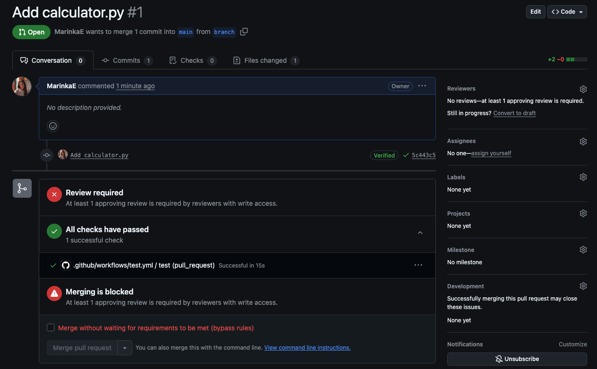

# GitHub Actions

**GitHub Actions** is a CI/CD tool that is built into GitHub. It allows you to **run workflows based on events that happen in your repository**. For example, you can run a workflow when a pull request is opened, or when a new commit is pushed to a branch.

It allows you to run tests, build your code, and deploy your application all from one place. It also has a lot of built-in integrations with other tools like Slack, Jira, and more.

For example you can automatically **run tests** before merging a pull request, or you can automatically **build a Docker image** when a new commit is pushed to a branch and then push it to a Docker registry. 

## How to use GitHub Actions

Let's start simple. We'll create a **workflow** that runs a test when a pull request is opened.

1. Create a **new repository** on GitHub
2. Create a `requirements.txt` file with the following content:

```
pytest
```

3. Create a new file called `tests/test_calculator.py` and add the following code:

```python
from src.calculator import add
import pytest

def test_add():
    assert add(1, 2) == 3
    assert add(-2, 2) == 0
    assert add(0, 0) == 0
```

4. Create a new file called `.github/workflows/test.yml` and add the following code:

```yaml
on:
  pull_request:
    branches:
      - main

jobs:
  test:
    runs-on: ubuntu-latest
    steps:
    - uses: actions/checkout@v3
    - name: Set up Python
      uses: actions/setup-python@v4
      with:
        python-version: '3.11.3'
    - name: Install dependencies
      run: |
        python -m pip install --upgrade pip
        pip install -r requirements.txt
    - name: Run tests
      run: |
        python -m pytest
```

5. Push your changes to GitHub into _main_

6. Go to the **Settings** tab in your repository and click on **Actions** -> **General**:
    - Workflow permissions: `Read and write permissions`
    - Check mark: `Allow GitHub Actions to create and approve pull requests`
    - **Save**

    

7. In the **Settings** go to **Branches** -> `Add classic branch protection rule`:
    - Branch name pattern: `main`
    - Check mark: `Require a pull request before merging`
      - Check mark: `Require approvals`
    - Click on **Create**

    

>The checks will run also without this but it is a good practice to require reviews before merging to main.

8. Now create a **new branch**

9. Add a python file called `src/calculator.py` with the following code:

```python
def add(a, b):
    return a + b
```

10. **Commit** your changes and **open a pull request** from your new branch to main. You should see the test running.

    

Often there are some checks that will run next to pytest. For example, if you have a linter, it will run and check if your code is formatted correctly. One example is [Black](https://black.readthedocs.io/en/stable/integrations/github_actions.html). It has also extensions or plugins for many IDEs like VSCode, PyCharm, etc.